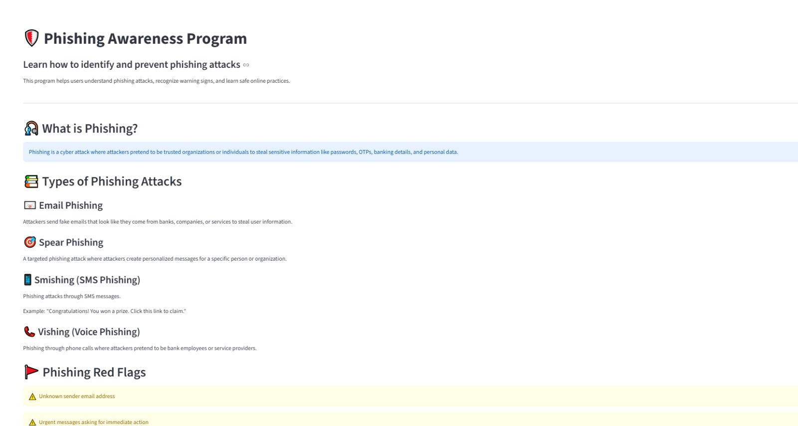
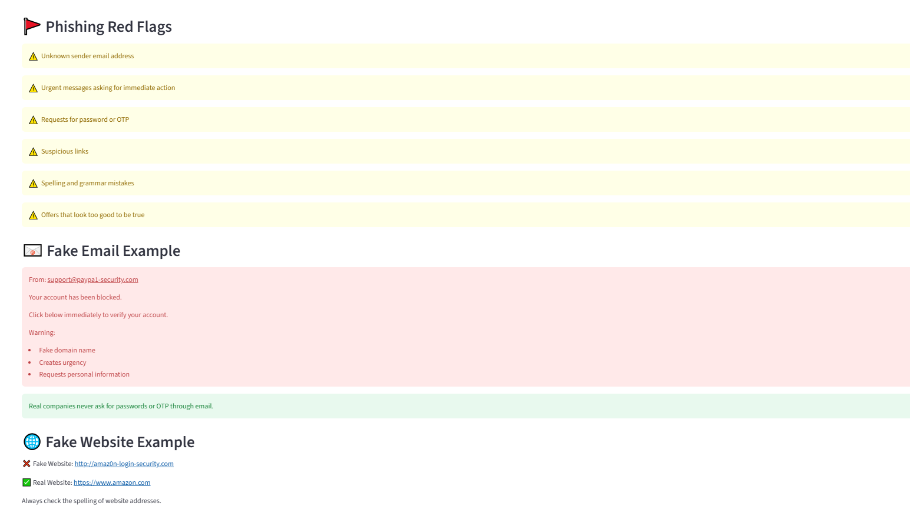

# 🛡️ Phishing Awareness Program

A Python-based **Phishing Awareness Program** developed using **Python and Streamlit**.

This application is designed to educate users about phishing attacks, identify suspicious activities, understand cyber threats, and learn safe online practices.

The project provides awareness about different phishing techniques such as Email Phishing, Spear Phishing, Smishing, and Vishing through examples, safety tips, and an interactive quiz.

---

# 📖 About The Project

The **Phishing Awareness Program** is a beginner-friendly cybersecurity awareness application developed to help users understand how phishing attacks work and how to prevent them.

Phishing is a social engineering attack where attackers pretend to be trusted sources to steal sensitive information such as:

- Passwords
- OTPs
- Banking Information
- Personal Data

This project demonstrates practical concepts of:

- Python Programming
- Streamlit Application Development
- Cybersecurity Awareness
- Social Engineering Concepts
- User Education

---

# ✨ Features

✔ Learn about Phishing Attacks  
✔ Different Types of Phishing Explanation  
✔ Email Phishing Awareness  
✔ Spear Phishing Awareness  
✔ Smishing (SMS Phishing) Awareness  
✔ Vishing (Voice Phishing) Awareness  
✔ Phishing Red Flags  
✔ Fake Email Examples  
✔ Fake Website Examples  
✔ Safety and Prevention Tips  
✔ Interactive Awareness Quiz  
✔ Quiz Score Evaluation  

---

# 🛠️ Technologies Used

## 🐍 Python

Used as the core programming language for developing the application.

## 🎨 Streamlit

Used for creating an interactive and user-friendly web application interface.

## 💻 VS Code

Used as the development environment.

## 🔧 Git & GitHub

Used for version control and project hosting.

---

# 📂 Project Structure

```
Phishing-Awareness-Program/

│
├── app.py                     # Main Streamlit application
├── data.py                    # Awareness content data
├── quiz.py                    # Quiz functionality
├── requirements.txt            # Required Python packages
├── README.md                   # Project documentation
├── LICENSE                    # MIT License
│
└── screenshots/
    ├── home_page.png           # Application home page screenshot
    └── home_page2.png          # Phishing awareness content screenshot
```

---

# 📋 Requirements

Before running this project, install:

- Python 3.8 or later
- Streamlit Library

Install dependencies:

```
pip install -r requirements.txt
```

---

# 🚀 Installation & Running

## Clone Repository

```
git clone https://github.com/YOUR_USERNAME/Phishing-Awareness-Program.git
```

---

## Open Project Folder

```
cd Phishing-Awareness-Program
```

---

## Create Virtual Environment

```
python -m venv .venv
```

---

## Activate Virtual Environment

Windows:

```
.\.venv\Scripts\Activate
```

---

## Install Required Packages

```
pip install -r requirements.txt
```

---

## Run Application

```
python -m streamlit run app.py
```

---

# 🖥️ Project Screenshots

## 🏠 Home Page




## 📚 Phishing Awareness Content



---

# ⚙️ How It Works

The application works in the following steps:

```
User Opens Application
          |
          ▼
Learn About Phishing Attacks
          |
          ▼
Understand Different Phishing Types
          |
          ▼
Identify Warning Signs
          |
          ▼
Learn Safety Measures
          |
          ▼
Test Knowledge Through Quiz
          |
          ▼
View Quiz Result
```

---

# 📚 Concepts Used

This project covers:

- Cybersecurity Awareness
- Phishing Attacks
- Social Engineering
- Email Security
- Website Security
- Online Safety Practices
- Python Programming
- Streamlit Development

---

# 🚀 Future Improvements

Future upgrades can include:

- User Login System
- More Quiz Questions
- Progress Tracking
- Certificate Generation
- Database Integration
- Advanced Phishing Detection Features

---

# ⚠️ Disclaimer

This project is created for **educational and awareness purposes only**.

The examples used in this application are created to demonstrate phishing awareness and prevention techniques.

Always verify links, emails, and messages before sharing sensitive information.

Use the internet safely and responsibly.

---

# 🤝 Contributing

Contributions are welcome.

Steps:

1. Fork this repository

2. Create a new branch

```
git checkout -b feature-name
```

3. Commit changes

```
git commit -m "Added new feature"
```

4. Push changes

```
git push origin feature-name
```

5. Create a Pull Request

---

# 📄 License

This project is licensed under the **MIT License**.

---

# 👨‍💻 Author

**Shubham Pashte**

Cybersecurity Enthusiast | Diploma Student

---

# 🔗 Project Links

## 📌 GitHub Profile

https://github.com/YOUR_USERNAME


## 📌 GitHub Repository

https://github.com/YOUR_USERNAME/Phishing-Awareness-Program


## 📌 LinkedIn Profile

https://www.linkedin.com/in/YOUR_LINKEDIN_USERNAME/

---

# ⭐ Support

If you find this project useful:

⭐ Star the repository  
🍴 Fork the project  
🐛 Report issues  
💡 Suggest improvements  

Thank you for supporting this project! 🚀